<!-- Design follows my portfolio: beige canvas, black ink, one yellow accent, Schibsted Grotesk + Hanken Grotesk. -->


  
  

Undergraduate AI researcher at FAST-NUCES Islamabad working across **computer vision**, **NLP** and **agentic systems**, with an accepted IBCAST 2026 paper.

It started with machines that could hold a conversation with people. I wanted to know how they worked, and the work below is where that question took me.

| **Agentic AI** | **Computer Vision** | **NLP** |
|---|---|---|
| Tool-using LLM agents with structured retrieval and long-horizon reasoning. | Foundation models like SAM, segmentation and medical imaging. | Retrieval-augmented generation over long, structured documents, and assistants that answer in English and Urdu. |

 


Papers and ongoing research in computer vision, medical imaging and machine learning.

### Feature-Level Fusion of Complementary Vision Transformers for Generalizable Medical Image Classification

Hassan Abdullah, **Muhammad Hamza**, Muhammad Ibrahim, Dr. Qurat Ul Ain · *IBCAST 2026* · **Accepted**

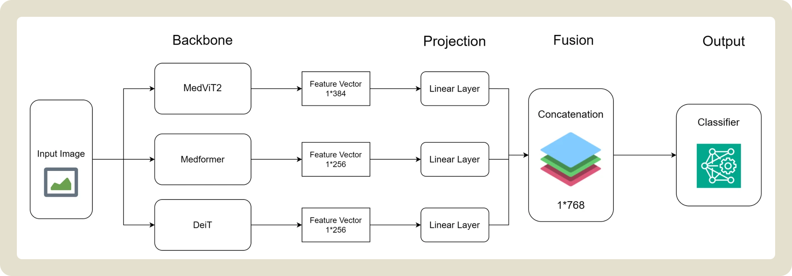

Fuses three frozen Vision Transformer backbones and trains only **0.75%** of the parameters, reaching **95.73%** on chest X-ray pneumonia, **93.17%** on brain MRI and **78.58%** on ISIC 2018 skin lesions across seven medical imaging datasets.

**My part:** led the ablation study across 7 backbone configurations and the cross-domain evaluation on 4 MedMNIST benchmarks.

[Code →](https://github.com/Hamza0590/Feature_Level_Fusion_of_Vision_Transformers)

### Resource- and Contention-Aware Edge Triage for Astronomical Transients · *ongoing*

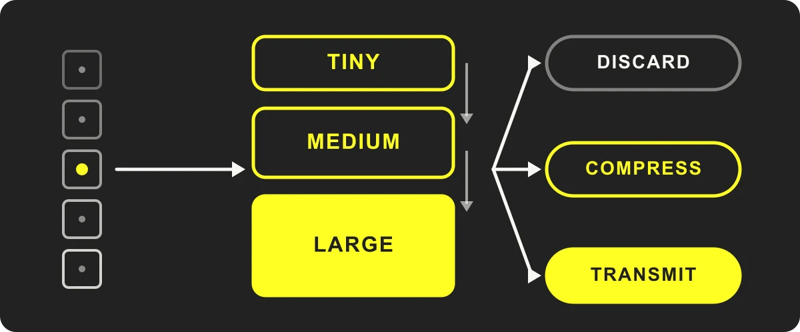

An edge system that decides, under limited compute, which model tier screens each astronomical transient candidate, how many inferences run at once, and whether the data is discarded, compressed or transmitted. A Tiny/Medium/Large CNN family classifies real versus bogus candidates from MeerCRAB/MeerLICHT cutouts; a resource-aware scheduler picks the tier and concurrency, and MC-dropout uncertainty escalates ambiguous candidates.

**Status:** in implementation. Results will be added once the experiments are complete.
**My part:** literature review, code and system review.

`Python` `PyTorch` `NumPy` `pandas` `scikit-learn` · [Code →](https://github.com/Hamza0590/Edge_Triage_System)

 


AI systems and research projects, from agentic retrieval to remote-sensing segmentation and edge AI.

### Tax Sathi — Agentic Tax Assistant for Pakistan

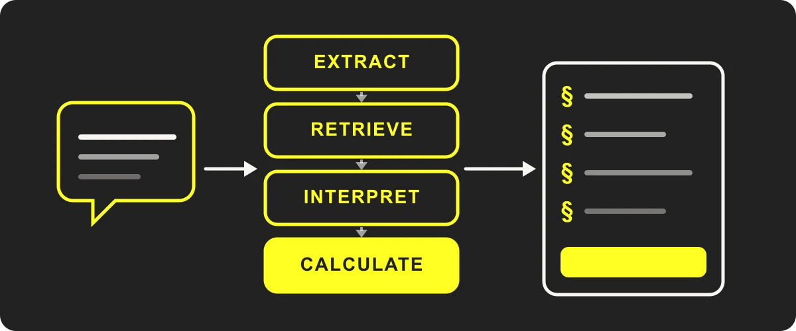

Turns a plain-English or Urdu description of income into a full Pakistani income-tax calculation, with FBR section citations and an auditable reasoning trace.

- **4-stage LangGraph pipeline:** extraction → retrieval → interpretation → calculation.
- **80+ ordinance sections** in a tree index over the Income Tax Ordinance 2001, searched in two passes that follow cross-references.
- **The LLM classifies, Python calculates:** the model only makes legal classification decisions; tax is computed deterministically from the FY 2025-26 rate tables, so every number is reproducible.
- Reads salary slips, withholding certificates and challans through a vision model, and shows the full reasoning trace in a live panel.

`LangGraph` `LiteLLM` `Groq LLaMA 3.3 70B` `FastAPI` `Pydantic` `Supabase` `React` · Solo · [Code →](https://github.com/Hamza0590/fbr-taxation-agent)

### Glacial Lake Semantic Segmentation — Reproduction Study

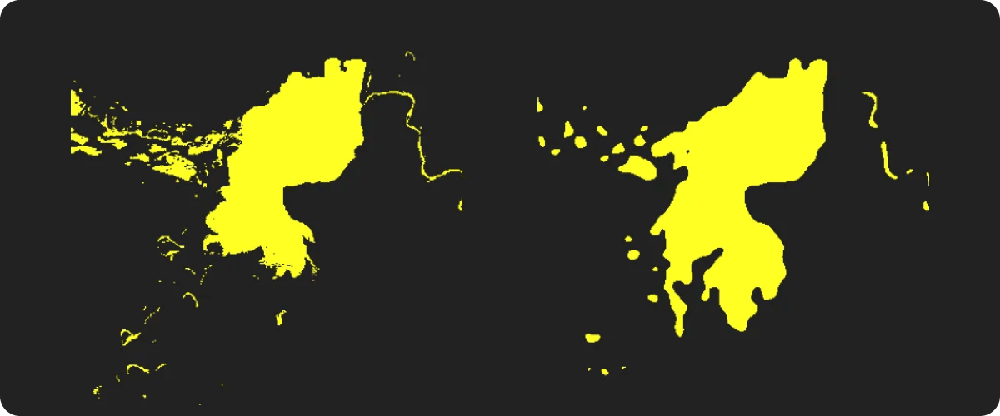

Reproduced the IEEE JSTARS 2025 study by Xue et al. in PyTorch: U-Net, Simple CNN and ASPP-SegNet trained on 410 Sentinel-2 tiles of the Himalayas, with a FastAPI + React app to compare their masks.

| Model | Val IoU | Val F1 |
|---|---|---|
| **ASPP-SegNet** | **0.9010** | **0.9479** |
| U-Net | 0.8693 | 0.9301 |
| Simple CNN | 0.8410 | 0.9136 |

Every deviation from the paper is documented with its reason. Lead developer in a two-person project.

`PyTorch` `Albumentations` `OpenCV` `FastAPI` `React` · [Code →](https://github.com/Hamza0590/glacial-lake-semantic-segmentation)

 


Internships across computer vision research and applied AI engineering.

**Computer Vision Research Intern** · SYSTEMS · Islamabad · *Jul – Aug 2026*
- Reproduced a supervisor-authored paper's architecture in PyTorch and fine-tuned SAM's mask decoder on the Massachusetts Buildings Dataset, raising mean IoU from **0.169 to 0.679** (4.02×) over zero-shot.
- Benchmarked fine-tuned SAM against RemoteSAM and vanilla zero-shot SAM on held-out aerial tiles, cutting segmentation errors by **2.59×** (F1 0.240 → 0.802).

**AI Intern** · Software Productivity Strategists · Islamabad · *Jul – Sep 2025*
- Designed an AI chatbot with IBM Watson Assistant, integrating NLP flows to automate client support and cutting manual response time by about **40%**.
- Provisioned 3 Azure VMs with site-to-site VPN and automated daily backups, reducing the data-loss window from **72h to under 24h**.
- Automated CI/CD with GitHub Actions and Azure DevOps (environment-gated approvals, automatic rollback), reducing manual deployment effort by about **60%**.

 


**Languages**

**ML & Deep Learning**

**LLMs & Agents**

**Computer Vision**

**Backend & Deployment**

**On GitHub**

 


 


  
  

© 2026 Muhammad Hamza
